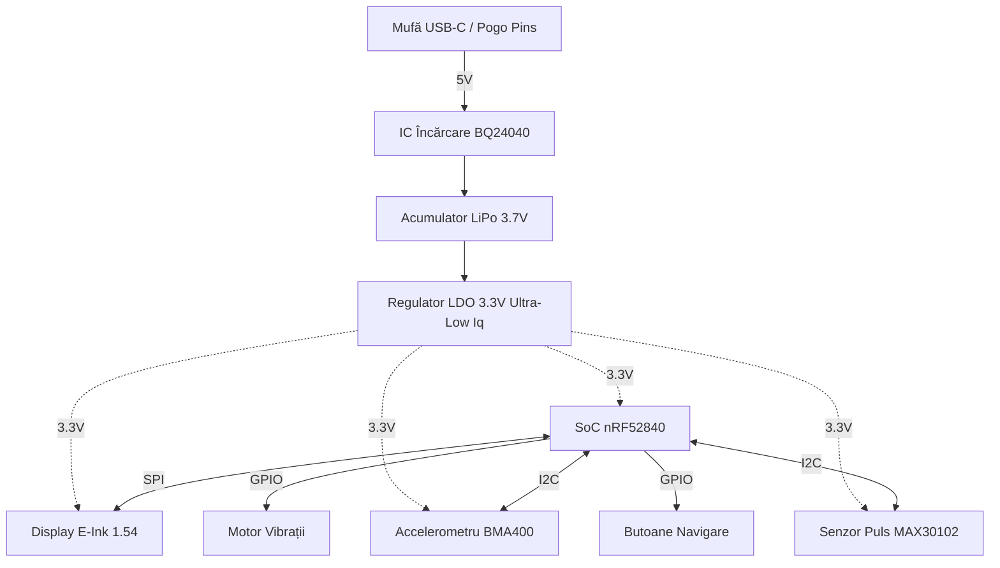

# InkTime - Open Source Smartwatch

InkTime este un proiect de smartwatch accesibil, open-source, conceput cu un accent puternic pe eficiența energetică și autonomia bateriei. Dispozitivul este construit în jurul ecosistemului nRF52840 (oferind conectivitate Bluetooth Low Energy) și folosește un ecran E-Ink pentru a asigura o vizibilitate excelentă în lumina soarelui cu un consum de energie aproape nul în stand-by.

Acest repository conține fișierele de design hardware pentru faza **EVT (Engineering Validation Test)**.

## 1. Diagrama Bloc a Sistemului

## 2. Bill Of Materials (BOM)

Tabelul de mai jos conține componentele principale folosite în designul plăcii. Lista completă (inclusiv rezistențe și condensatoare) se găsește în fișierul .csv din folderul Manufacturing.
| Componenta | Rol în sistem | JLC Part # | Link Datasheet |
| :--- | :--- | :--- | :--- |
| **nRF52840-QIAA** | Microcontroller principal (BLE, Cortex-M4F) | C206001 | [Datasheet nRF52840](https://infocenter.nordicsemi.com/pdf/nRF52840_PS_v1.7.pdf) |
    | **BQ24040DSQR** | IC Incarcare Acumulator LiPo (1A) | C43012 | [Datasheet BQ24040](https://www.ti.com/lit/ds/symlink/bq24040.pdf) |
| **TPS7A0533PDQNR** | LDO 3.3V (Consum Quiescent extrem de mic - 1µA) | C396492 | [Datasheet TPS7A05](https://www.ti.com/lit/ds/symlink/tps7a05.pdf) |
| **BMA400** | Accelerometru Ultra-Low Power (Pedometer) | C383215 | [Datasheet BMA400](https://www.bosch-sensortec.com/media/boschsensortec/downloads/datasheets/bst-bma400-ds000.pdf) |
| **MAX30102** | Senzor Optic Puls și SpO2 | C84666 | [Datasheet MAX30102](https://www.analog.com/media/en/technical-documentation/data-sheets/MAX30102.pdf) |
| **Ecran E-Ink 1.54 inch** | Display principal (SPI) | N/A (Modul) | [Datasheet Waveshare](https://www.waveshare.com/wiki/1.54inch_e-Paper_Module) |
## 3. Descrierea Functionalitatii Hardware

### Procesare si Conectivitate:
Inima ceasului InkTime este SoC-ul Nordic nRF52840. A fost ales datorita suportului nativ pentru Bluetooth 5.0 (BLE), esential pentru sincronizarea notificarilor cu telefonul mobil. Arhitectura ARM Cortex-M4F permite procesarea eficienta a algoritmilor de numarare a pasilor si calcul al ritmului cardiac.

### Managementul Consumului de Energie (Power Tree):
Fiind un dispozitiv wearable, constrângerile de baterie sunt critice.

Sistemul este alimentat de o baterie LiPo de mici dimensiuni (ex. 200mAh).

Încărcarea se face la 5V printr-un circuit BQ24040, reglat din rezistențe pentru a oferi un curent de încărcare mic și sigur (ex. 100mA).

Pentru a coborî tensiunea la 3.3V am folosit un LDO din seria TPS7A05, care are un curent de repaus (Iq) de doar 1µA, esențial pentru a nu drena bateria când ceasul este în Deep Sleep.

### Periferice și Interfețe:

Display-ul E-Ink: Comunică prin protocol SPI. Deși are un framerate mic, este perfect pentru un ceas deoarece consumă 0mA pentru a menține imaginea afișată.

Senzorii (IMU & HR): Comunicația se realizează pe o magistrală I2C partajată. BMA400 are un mod special de "step counter" hardware care poate trezi microcontroller-ul din sleep doar când utilizatorul face un pas, economisind masiv energia.

## 4. Alocarea Pinilor nRF52840

Microcontroller-ul nRF52840 permite maparea flexibilă a pinilor (orice funcție digitală pe orice pin), lucru care a facilitat o rutare curată (fără suprapuneri) pe PCB.
| Pin nRF52840 | Nume Net / Funcție | Justificare / Detalii |
| :--- | :--- | :--- |
| **P0.13 / P0.14 / P0.15** | `SPI_SCK`, `SPI_MOSI`, `SPI_MISO` | Magistrala SPI dedicată ecranului E-Ink. Pinii au fost aleși pe aceeași latură a chip-ului cu conectorul FPC al ecranului. |
| **P0.16** | `EINK_CS` (Chip Select) | Activare magistrală SPI pentru ecran. |
| **P0.17 / P0.18** | `EINK_DC`, `EINK_RST` | Pini de control adiționali (Data/Command și Reset) necesari controller-ului de E-Ink. |
| **P0.26 / P0.27** | `I2C_SDA`, `I2C_SCL` | Magistrala I2C pentru accelerometru (BMA400) și senzorul de puls (MAX30102). Conține rezistențe de pull-up de 4.7k. |
| **P1.02** | `IMU_INT` (Interrupt) | Pin setat ca Input. BMA400 trimite un semnal aici pentru a trezi SoC-ul când detectează mișcare. |
| **P1.06** | `MOTOR_PWM` | Pin configurat ca ieșire PWM, conectat la poarta unui tranzistor MOSFET N-Channel pentru a acționa motorul de vibrații (notificări haptice). |
| **P0.11 / P0.12** | `BTN_UP`, `BTN_DOWN` | Pini conectați la butoanele laterale, configurați cu Input Pull-Up intern. |
## 5. Design Log & Integrare Mecanică (EVT Phase)

### Construcția PCB-ului: 
Cablajul a fost realizat pe 2 straturi. Pentru a asigura performanța antenei, a fost respectată zona de keepout cerută în datasheet-ul antenei ceramice (sau PCB trace), neavând planuri de masă sub aceasta.

### Constrângeri Mecanice: 
Forma PCB-ului a fost dictată strict de fișierul .step al carcasei primite. Decupajele plăcii se aliniază perfect cu pinii de montare ai carcasei.

### Stack-up 3D: 
Modelul 3D final validează faptul că placa de bază, bateria (poziționată sub PCB) și display-ul E-Ink (deasupra PCB-ului) intră în carcasa de smartwatch fără coliziuni de componente.

## 5. Calcule Detaliate de Consum de Energie (Power Budget)

Pentru a estima durata de viata a bateriei, am analizat consumul principalelor componente din circuit (nRF52840, IMU, DC/DC converter) in doua scenarii principale: Mod Activ si Mod Sleep (Standby).

### 1. Parametrii Bateriei
* Tip baterie: Li-Po
* Tensiune nominala: 3.7V
* Capacitate: 500 mAh

### 2. Consum in Mod Activ (Transmisie BLE + Achizitie Date IMU)
Cand dispozitivul este treaz, citeste date de la senzori si transmite pachete prin Bluetooth.
* nRF52840 (CPU + TX/RX la 0dBm): ~14.0 mA
* Senzor IMU (Mod Activ): ~1.0 mA
* Pierderi DC/DC Converter (Eficienta 90%): ~1.5 mA
* Total Consum Activ: ~16.5 mA

### 3. Consum in Mod Sleep (Standby / System OFF)
Cand dispozitivul nu este folosit, microcontrolerul intra in deep sleep, iar senzorii sunt trecuti in power-down.
* nRF52840 (System OFF, RAM retention): ~1.5 uA (0.0015 mA)
* Senzor IMU (Mod Power-Down): ~5.0 uA (0.005 mA)
* Quiescent Current DC/DC + LDO: ~10.0 uA (0.01 mA)
* Total Consum Sleep: ~16.5 uA (0.0165 mA)

### 4. Estimarea Duratei de Viata a Bateriei (Battery Life)

Scenariul A: Utilizare Continua (100% Mod Activ)
Daca dispozitivul ar transmite date non-stop:
* 500 mAh / 16.5 mA = 30.3 ore de functionare continua.

Scenariul B: Dispozitiv lasat pe birou (100% Mod Sleep)
Daca dispozitivul este pur si simplu lasat in stand-by:
* 500 mAh / 0.0165 mA = 30,303 ore = Aproximativ 3.4 ani.

Scenariul C: Utilizare Realista (Mix: 5% Activ, 95% Sleep)
Presupunand ca dispozitivul se trezeste periodic pentru a trimite date:
* Consum mediu = (16.5 mA * 0.05) + (0.0165 mA * 0.95) = 0.825 mA + 0.015 mA = 0.84 mA
